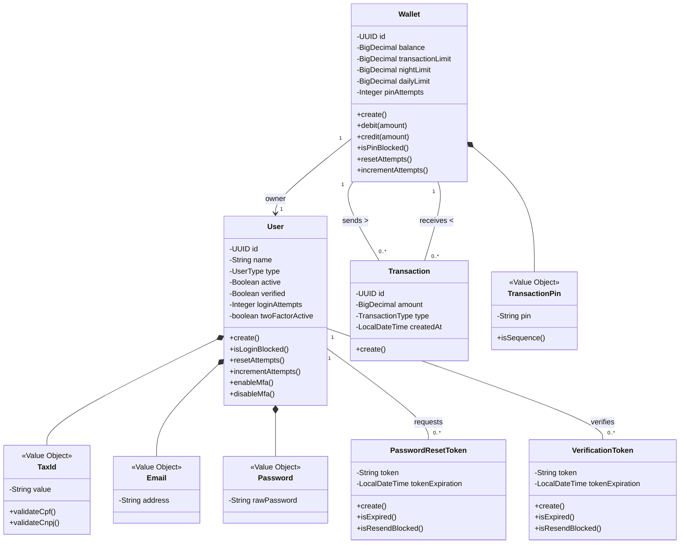
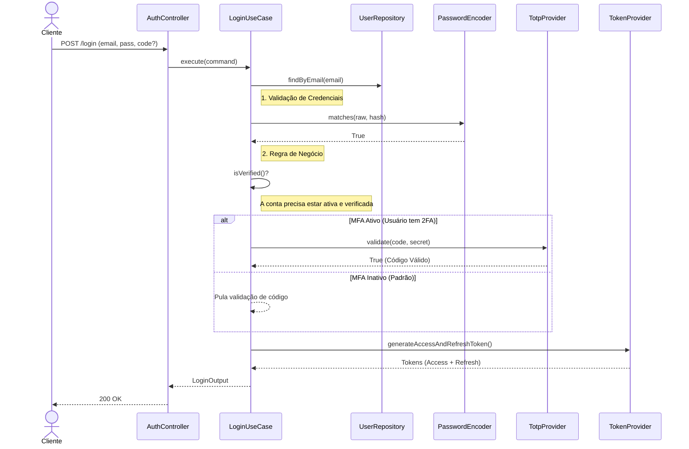
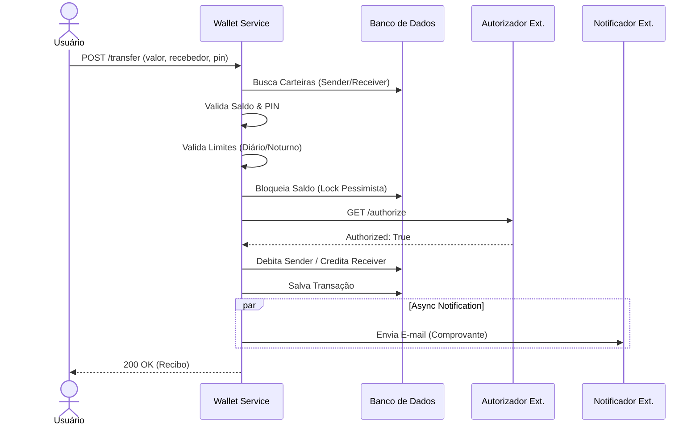
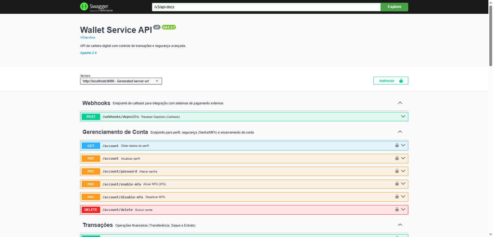
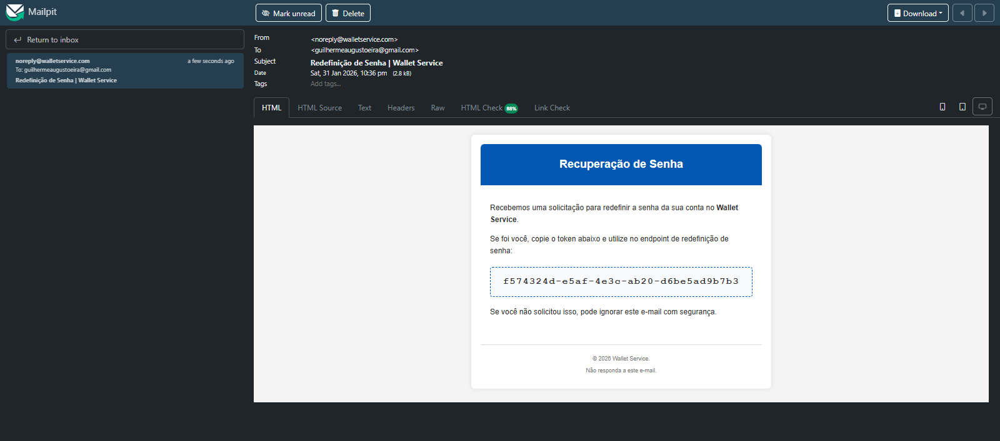

# Wallet Service API 💳

O **Wallet Service** é uma API robusta para gestão de carteiras digitais e transações financeiras. O objetivo foi resolver o **[Desafio Backend do PicPay](https://github.com/PicPay/picpay-desafio-backend)**, que propõe a criação de uma plataforma de pagamentos simplificada, mas adicionando camadas extras de segurança e regras de negócio complexas.

## 🏗️ Arquitetura e Design

O projeto adota uma abordagem híbrida entre **Clean Architecture** e **Hexagonal Architecture (Ports and Adapters)**. O objetivo principal é proteger o núcleo da aplicação (Regras de Negócio) de influências externas e detalhes de implementação.

O sistema é dividido em camadas concêntricas respeitando a **Regra de Dependência**: *As camadas internas não conhecem as camadas externas.*

* **Domain (Core):** O coração da aplicação. Contém as Entidades e Regras de Negócio puras. É agnóstico a frameworks, banco de dados ou interfaces web.
* **Application:** Camada de orquestração. Define os Casos de Uso (o que o sistema faz) e os Contratos/Portas (o que o sistema precisa para funcionar).
* **Adapter:** A ponte com o mundo real. Implementa as conexões com Banco de Dados, APIs externas e expõe os Endpoints REST.
* **Infra:** Configurações de baixo nível e filtros de segurança.

### 📂 Estrutura de Pastas

A organização dos pacotes reflete a arquitetura hexagonal, isolando domínio, aplicação e infraestrutura:

```text
src/main/java/io/github/guilherme_eira/wallet_service
├── domain              # Regras de Negócio e Entidades
│   ├── enumeration     # Enums do sistema (UserType, TransactionType)
│   ├── exception       # Exceções de negócio
│   ├── model           # Modelos de domínio (Agnósticos a banco de dados)
│   └── valueobject     # Objetos de Valor (TaxId, Email, TransactionPin)
├── application         # Casos de Uso e Orquestração
│   ├── port            # Interfaces de Entrada e Saída
│   │   ├── in          # Contratos dos UseCases
│   │   └── out         # Contratos dos Gateways (Portas de Saída)
│   ├── service         # Implementação dos UseCases
│   ├── validator       # Regras de validação complexas
│   ├── dto             # Objetos de transferência internos
│   ├── mapper          # Conversão Modelo ↔ DTO
│   └── exception       # Exceções de fluxo de aplicação
├── adapter             # Implementações e Integrações
│   ├── inbound         # Entrada de dados
│   │   ├── web         # Controllers REST e DTOs (Request/Response)
│   │   └── scheduler   # Tarefas agendadas (Jobs)
│   └── outbound        # Saída de dados
│       ├── persistence # Camada de Persistência
│       │   ├── entity        # Entidades JPA (Tabelas do Banco)
│       │   ├── repository    # Interfaces Spring Data JPA
│       │   └── implementation# Implementação das Portas de Saída (Adapters)
│       ├── integration # Clients Feign, Records e Adaptadores
│       ├── notification# Serviços de envio de e-mail
│       ├── auth        # Gerenciamento de tokens
│       ├── cryptography# Criptografia e Hashing
│       └── mapper      # Conversão Modelo ↔ Entidade JPA
└── infra               # Configurações e Frameworks
    ├── config          # Configurações globais (Swagger, Timezone)
    └── security        # Segurança (Filtros, SecurityConfig)
```

## 🔗 Diagrama de Classes


## ⚙️ Funcionalidades

Abaixo estão os principais recursos expostos pela API:

### 📌 Autenticação e Segurança
* **Registro de Usuários:** Criação de conta para perfis Comuns e Lojistas.
* **Verificação de E-mail:** Ativação de conta via token, impedindo cadastros falsos.
* **Login Seguro:** Autenticação via credenciais com suporte a **Refresh Token** para renovação de sessão sem logout.
* **Autenticação Multifator (MFA):** Fluxo de login preparado para validar códigos TOTP (Time-based One-Time Password) se o 2FA estiver ativo.
* **Recuperação de Senha:** Fluxo completo de *Forgot Password* e *Reset Password* via tokens seguros.

#### Fluxo de Autenticação



### 📌 Transações Financeiras
* **Transferência P2P:** Envio de valores entre carteiras (Usuário ➝ Usuário/Lojista). Exige PIN Transacional para autorizar a operação.

* **Simulação de Saque:** Retirada de valores da carteira digital para meios externos.
* **Simulação de Depósitos:** Entrada de valores na carteira digital. Simulamos a notificação de depósito enviada por um gateway de pagamento externo, processando o crédito na conta do usuário.
    * *Segurança:* Protegido via validação de **Header Secreto** (`X-WEBHOOK-SECRET`) para garantir a integridade da origem.
* **Extrato Bancário:** Consulta de histórico de movimentações com **paginação** e **ordenação** dinâmica.

#### Fluxo de Transferência




### 📌Gestão de Carteira
* **Consulta de Saldo:** Visualização do saldo disponível e limites (Diário e Noturno).
* **Gestão de PIN:** Alteração da senha transacional (Exige confirmação de senha).

### 📌 Gerenciamento de Conta
* **Perfil:** Consulta e atualização de dados cadastrais.
* **Segurança (MFA):**
    * *Ativar:* Gera URL para QR Code compatível com apps autenticadores (Google Auth, Authy).
    * *Desativar:* Remove a camada extra de segurança mediante confirmação de senha.
* **Alteração de Senha:** Troca de credenciais de acesso exigindo a senha antiga.
* **Encerramento de Conta:** Exclusão lógica (Soft Delete) do usuário (permitido apenas se o saldo for zero).

## 💻 Tecnologias Utilizadas

Abaixo estão as principais tecnologias, frameworks e bibliotecas utilizadas na construção da API:

| Área | Tecnologia | Versão | Descrição |
| :--- | :--- | :--- | :--- |
| **Core** | Java | 21 | Linguagem de programação moderna (LTS). |
| | Spring Boot | 4.0.2 | Framework base para configuração e inversão de controle. |
| **Segurança** | Spring Security | 6.x | Autenticação, Autorização e proteção contra ataques. |
| | Auth0 Java JWT | 4.5.0 | Geração e validação de tokens JWT (Stateless). |
| | Atlassian Onetime | 2.1.2 | Biblioteca para geração e validação de códigos TOTP (2FA). |
| **Persistência** | Spring Data JPA | - | Abstração de repositórios e acesso a dados (ORM). |
| | PostgreSQL | - | Banco de dados relacional principal (Produção/Docker). |
| | H2 Database | - | Banco de dados em memória para testes de integração rápidos. |
| | Flyway | - | Versionamento e migração evolutiva do banco de dados. |
| **Integração** | OpenFeign | 2025.1.0 | Cliente HTTP declarativo para comunicação com serviços externos. |
| | Spring Mail | - | Serviço para envio de e-mails transacionais (Async). |
| **Documentação** | SpringDoc OpenAPI | 2.8.14 | Geração automática da documentação da API (Swagger UI / Scalar). |
| **Ferramentas** | MapStruct | 1.6.3 | Mapeamento de alta performance entre Entidades e DTOs. |
| | Lombok | - | Redução de código boilerplate (Getters, Setters, Builders). |
| | Bean Validation | - | Validação robusta de dados de entrada nos DTOs. |
| **Testes** | JUnit 5 | - | Framework principal para execução de testes. |
| | Mockito | - | Criação de Mocks para isolamento em testes unitários. |
| **Infra / DevOps** | Docker | - | Containerização da aplicação e banco de dados. |
| | Docker Compose | - | Orquestração dos containers (App, DB, Mailpit, WireMock). |

## 🔬 Testes Automatizados

A seguir, descrevem-se os tipos de testes implementados e seus respectivos objetivos.

### 1. Testes Unitários (Domain & Application)
Focados na validação isolada das regras de negócio e comportamento das entidades, sem depender de frameworks ou banco de dados.
* **Cobertura:** Services, Validators e Value Objects.
* **O que validam:** Garantem que a lógica de negócio está correta e que as **Exceptions Personalizadas** são disparadas adequadamente sempre que uma regra é violada em qualquer uma dessas camadas.

### 2. Testes de Integração (Infrastructure)
Validam a interação entre os componentes do Spring e o Banco de Dados.
* **Repositories:**
    * Verificação da lógica de **Pessimistic Lock** (`SELECT ... FOR UPDATE`) para garantir a consistência em concorrência.
    * Validação de queries personalizadas (JPQL/Native).
* **Controllers:**
    * Validação dos contratos da API (Status Code, JSON Response).
    * Testes nos **fluxos de Login**, incluindo cenários de sucesso, falha por credenciais, bloqueio temporário e exigência de MFA.

### 3. Teste End-to-End
Simulação de fluxos completos que atravessam todas as camadas do sistema.
* **Cenário de Soft Delete:** Valida a lógica de reaproveitamento de informações sensíveis.
    * *Fluxo:* Verifica o comportamento do sistema quando um usuário deletado tenta se cadastrar novamente ou quando seus dados históricos precisam ser preservados para auditoria sem conflitar com novos registros.

### ⚙️ Como Executar

Para rodar a suíte completa de testes:

```bash
./mvnw test
```

## 🚀 Como Executar o Projeto

A maneira mais simples de rodar a aplicação é utilizando **Docker Compose**, que sobe automaticamente a API, o Banco de Dados, os Mocks e o servidor de e-mail local.

### Pré-requisitos
* **Docker** e **Docker Compose** instalados em sua máquina.

### Passo a Passo

#### 1. Clonar o Repositório
```bash
git clone https://github.com/guilherme-eira/wallet-service-api.git
cd wallet-service
```

### 2. Configurar Variáveis de Ambiente
O projeto utiliza um arquivo `.env` para gerenciar credenciais sensíveis.
Crie um arquivo chamado `.env` na raiz do projeto (baseado no `.env-example`) e preencha conforme o exemplo abaixo:

> **Nota:** A `DB_HOST` deve apontar para `db` (nome do serviço no Docker), e não `localhost`.

```properties
# --- Configuração do Banco de Dados (Aplicação) ---
DB_URL=jdbc:postgresql://db:5432/wallet_service_db
DB_USERNAME=postgres
DB_PASSWORD=secret_password

# --- Configuração do Container Postgres (Docker) ---
POSTGRES_DB=wallet_service_db
POSTGRES_USER=postgres
POSTGRES_PASSWORD=secret_password

# --- Configuração de E-mail (Mailpit) ---
MAIL_HOST=mailpit
MAIL_PORT=1025
MAIL_USERNAME=
MAIL_PASSWORD=

# --- Segurança ---
# Chave para assinatura dos tokens JWT (Mínimo 32 caracteres)
JWT_SECRET=coloque_sua_chave_secreta_aqui_com_pelo_menos_32_chars
# Segredo para validar a origem do Webhook de Depósito
WEBHOOK_SECRET=segredo_para_validar_webhooks

# --- Integrações (Mocks) ---
MOCK_URL=http://wiremock:8080
```

### 3. Subir a Aplicação
Na raiz do projeto, execute o comando para construir a imagem e subir os containers:

```bash
docker-compose up -d --build
```
*O processo de build pode levar alguns minutos na primeira execução.*

### 4. Acessar os Serviços

Uma vez que os containers estiverem rodando, você pode acessar:

- **Documentação da API (Swagger):** http://localhost:8080/swagger-ui.html \
  *Utilize esta interface para testar os endpoints visualmente.*

- **Mailpit (Caixa de Entrada de Teste):** http://localhost:8025 \
  *Qualquer e-mail enviado pelo sistema (tokens de verificação, recuperação de senha) será interceptado e aparecerá aqui.*

- **WireMock (Admin):** http://localhost:8081/__admin \
  *Para verificar os stubs dos serviços externos.*

- **Banco de Dados:** Conecte-se via DBeaver/PgAdmin em `localhost:5432` com as credenciais definidas no `.env`.

#### 📸 Screenshots
Visualização dos serviços rodando localmente:

| Documentação Interativa (Swagger) | Simulação de E-mail (Mailpit) |
| :---: | :---: |
|  |  |
